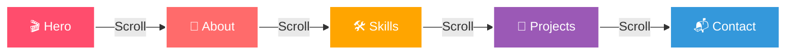

<!-- ✨ ANIMATED HEADER BANNER ✨ -->
<div align="center">

<a href="https://github.com/Sarathsai4/My-Portfolio">
  
</a>

<!-- 🌌 Animated Typing Intro -->
<a href="https://github.com/Sarathsai4">
  
</a>

<br/>

<!-- 🎯 Live Demo / Visitor / Stars / Forks -->
<p>
  <a href="https://github.com/Sarathsai4/My-Portfolio">
    
  </a>
  
  
  
</p>

</div>

<!-- 🌠 Animated Divider -->


<br/>

<!-- 🪐 ABOUT THE PROJECT -->
<h2 align="center">
  
  &nbsp;About The Project&nbsp;
  
</h2>

<table align="center">
<tr>
<td width="55%">

> A **modern, immersive 3D developer portfolio** built to showcase technical expertise, creativity, and professional identity through **interactive visuals** and **smooth motion design**.

🎨 Designed as a **recruiter-friendly alternative** to traditional portfolios — every pixel is crafted to leave an impression.

```diff
+ Interactive 3D environments
+ Cinematic scroll animations
+ Polished UI components
+ Responsive on every device
! Built with bleeding-edge tech
```

</td>
<td width="45%" align="center">


</td>
</tr>
</table>

---

<!-- 🎯 OBJECTIVE -->
<h2 align="center">🎯 Objective</h2>

<div align="center">

| 🌟 | Goal |
|----|------|
| 🚀 | Build a **high-impact personal portfolio** using modern frontend & 3D tech |
| 🎨 | Combine **visual storytelling** with **professional developer branding** |
| 🧠 | Demonstrate hands-on expertise in **React, 3D rendering & UI engineering** |
| 💼 | Provide a visually engaging, **recruiter-friendly** alternative to traditional resumes |
| 📈 | Serve as a scalable foundation for **showcasing projects & case studies** |

</div>

---

<!-- ✨ KEY FEATURES -->
<h2 align="center">✨ Key Features</h2>

<div align="center">

<table>
<tr>
<td align="center" width="33%">
<br/>
<b>🌐 3D Rendering</b><br/>
<sub>React Three Fiber + Drei abstractions for interactive scenes</sub>
</td>
<td align="center" width="33%">
<br/>
<b>🎬 Animations</b><br/>
<sub>Scroll-based transitions & micro-interactions with Framer Motion</sub>
</td>
<td align="center" width="33%">
<br/>
<b>🎨 UI & Styling</b><br/>
<sub>Responsive & accessible interface with TailwindCSS</sub>
</td>
</tr>
<tr>
<td align="center">
<br/>
<b>📬 Contact Handling</b><br/>
<sub>Functional contact form integrated via EmailJS</sub>
</td>
<td align="center">
<br/>
<b>💎 UI Enhancements</b><br/>
<sub>Polished components from Aceternity UI & Magic UI</sub>
</td>
<td align="center">
<br/>
<b>⚡ Tooling & Builds</b><br/>
<sub>Lightning-fast dev & optimized builds powered by Vite</sub>
</td>
</tr>
</table>

</div>

---

<!-- 🛠 TECH STACK -->
<h2 align="center">🛠 Tech Stack</h2>

<div align="center">

<a href="#"></a>

<br/><br/>


</div>

<details>
<summary><b>📦 Detailed Tech Breakdown — Click to expand</b></summary>

<br/>

| Tool / Library | Purpose |
|----------------|---------|
| ⚛️ **React** | Core frontend framework |
| ⚡ **Vite** | Fast build tool & dev server |
| 🎨 **TailwindCSS** | Utility-first styling |
| 🌐 **React Three Fiber** | Declarative 3D rendering with Three.js |
| 🧩 **Drei** | Helpers & abstractions for R3F |
| 🎬 **Framer Motion** | Animations & transitions |
| 📧 **EmailJS** | Contact form email integration |
| 💎 **Aceternity UI** | Advanced UI components |
| ✨ **Magic UI** | Prebuilt interactive UI elements |

</details>

---

<!-- 🧭 PORTFOLIO SECTIONS -->
<h2 align="center">🧭 Portfolio Sections</h2>

<div align="center">



</div>

| Section | Description |
|---------|-------------|
| 🎬 **Hero** | 3D introduction with cinematic motion effects |
| 👤 **About** | Professional background & personal branding story |
| 🛠 **Skills** | Technical stack overview with interactive cards |
| 💼 **Projects** | Featured work, case studies & highlights |
| 📬 **Contact** | Interactive form with real-time email delivery |

> Each section balances **visual impact** with **clarity and usability**.

---

<!-- 🗂 PROJECT STRUCTURE -->
<h2 align="center">🗂 Project Structure</h2>

```bash
📦 My-Portfolio
├── 📂 public/
│   ├── 🖼  assets/        # Images, textures, static files
│   ├── 🪐 models/         # 3D models (Astronaut, etc.)
│   └── ⚡ vite.svg
├── 📂 src/
│   ├── 🧩 components/     # Reusable UI components
│   ├── 📊 constants/      # Static configuration & data
│   ├── 📑 sections/       # Page sections (Hero, About, Projects)
│   ├── 🎯 App.jsx         # Main application logic
│   ├── 🎨 index.css       # Global styles (Tailwind)
│   └── 🚪 main.jsx        # Application entry point
├── ⚙️  tailwind.config.js
├── ⚙️  vite.config.js
└── 📦 package.json
```

---

<!-- 🚀 GETTING STARTED -->
<h2 align="center">🚀 Getting Started</h2>

```bash
# 1️⃣ Clone the repository
git clone https://github.com/Sarathsai4/My-Portfolio.git

# 2️⃣ Move into the directory
cd My-Portfolio

# 3️⃣ Install dependencies
npm install

# 4️⃣ Start the dev server
npm run dev

# 5️⃣ Build for production
npm run build
```

---

<!-- 📊 GITHUB STATS -->
<h2 align="center">📊 Repository Stats</h2>

<div align="center">


<br/><br/>


<br/><br/>


<br/><br/>

<!-- 🐍 Contribution snake -->


</div>

---

<!-- 🌟 CONNECT -->
<h2 align="center">🌟 Connect With Me</h2>

<div align="center">

<a href="https://github.com/Sarathsai4">
  
</a>
<a href="https://www.linkedin.com/in/sarathsai4/">
  
</a>
<a href="mailto:contact@sarathsai.dev">
  
</a>
<a href="https://github.com/Sarathsai4/My-Portfolio">
  
</a>

</div>

---

<!-- 💖 SUPPORT -->
<div align="center">

### ⭐ If you like this project, give it a star! ⭐


</div>

<!-- 🌊 FOOTER WAVE -->

